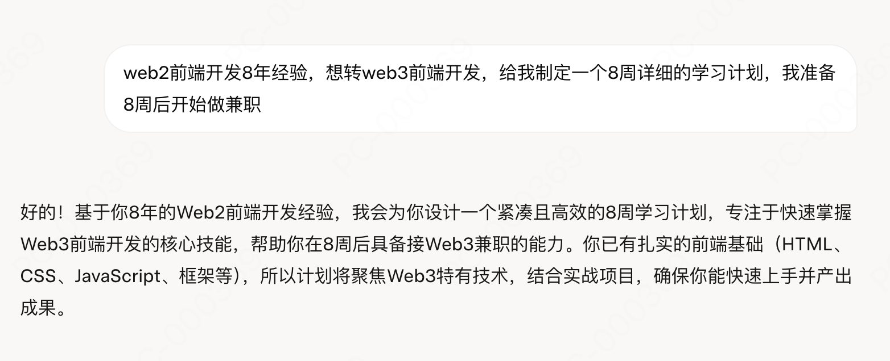

# 🏄‍♂️ 背景
2025年2月份的某一天，看到了关于一篇讲解如何了解“web3”的文章。很早其实就听说过关于web3,加密货币的一些信息，身边也有人相继从事此行业，但是自己习惯了稳定的工作，疏忽于学习，深感落后，做了很多年的web2前端开发，却发现自己忽然打开了一个魔法之门，门外的世界全都是不知道的知识和信息

> 以下操作的内容均需要科学上网 🚀

- ✅ 第一步，注册了一个Metamask钱包，拥有了自己的wallet address，并且在其官网学习了11章节的关于web3涉及的知识点，扫盲一遍所有需要了解的内容，虽然看完后依旧啥都不懂

- ✅ 第二步，为了体验学习内容相对快，我又在币安（可以中文）注册了一个中心化托管的币安钱包，并且在其官网学习完毕了6章课程和数篇博客关于加密货币的知识，后面我发现很多交易平台都有免费的课程和文章可以学习，学习完还奖励了usd

- ✅ 第三步，有了钱包后开始在一些网站尝试他们的airdrops(所谓的空投)，发现有点类似拼多多拉人游戏，不是专业玩家耗时耗精力果断放弃

就这样，科学上网后我拥有注册了X账号，还有2个钱包，以及各种搜索学习扫盲一遍每个名词的意义，顺便学了很多英文，确定了我要做整个web3生态里最繁荣的应用层， DApps相关的开发，以下和我一起开启学习web3的技术之路吧。

# 📚 AI帮我学
### （https://grok.com/chat/）

我发现很多人不知道怎么转行，也不知道怎么学习，我也是一样，但是把自己的问题提问给AI就好了，讲述自己已经做了哪些工作，想转行该学习什么，甚至我让它帮我制定了一个详细的8周学习计划

提问后会给你一个非常详细的计划，那么此后我会按照这个计划分享学习内容

## 🔥 学习目标
- 掌握区块链和Web3基础知识。
- 学会与区块链交互（主要是以太坊生态）
- 开发并部署一个简单的DApp前端。
- 准备一个可展示的项目，为兼职工作打基础
- 学好英语 [我的英语日更笔记](./english/daily.md)

## 📒 理解图例 （我们主要致力于研究技术实现层）

## 📕 学习目录
- [1开发工具准备](./docs/01tools.md)
- [2关于Web3的世界观](./docs/02views.md)

