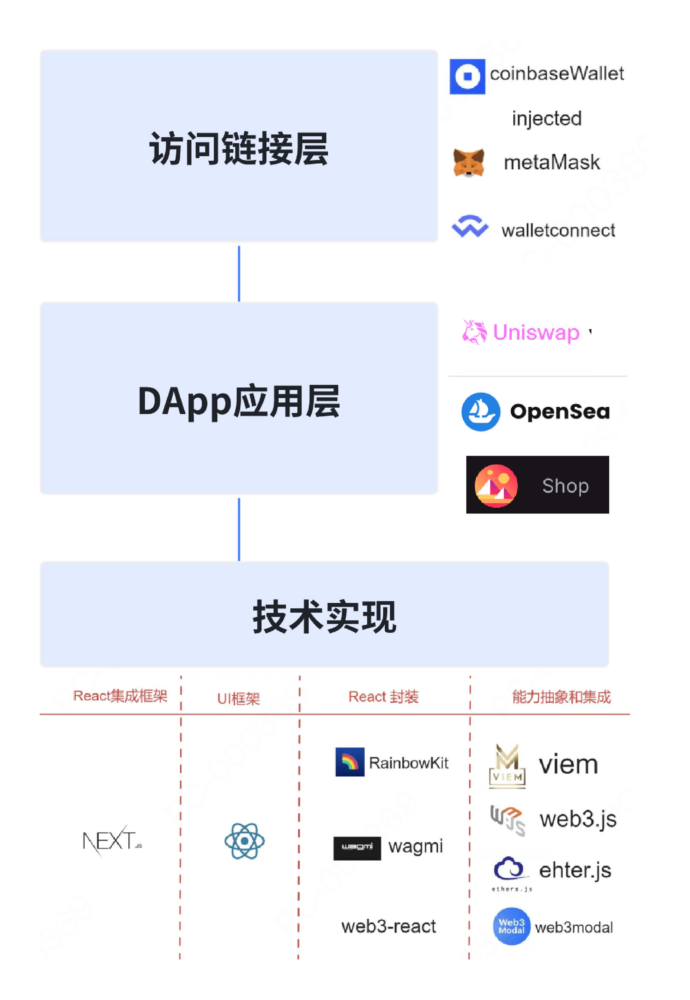

## 👛 链接web3钱包

### 1.了解Chrome扩展插件

因为大多数web3钱包都是以chrome插件形式存在，所以我们要先了解chrome插件的简单原理。开发过chrome插件的小伙伴肯定知道，开发插件需要安装规定配置以下文件

 ```text
    my-extension/
    ├── manifest.json // 这是插件的核心配置文件
    ├── popup.html // 这个文件定义插件点击时的界面
    ├── popup.js // 编写逻辑脚本
```

以上我们会根据复杂的插件功能做进阶配置，我们的插件在与与网页通信的时候，会调用chrome的API,Chrome插件通过manifest.json中的content_scripts字段，在特定网页（通常是所有网页，即"matches": ["<all_urls>"]）中注入JavaScript代码,比如可以注入你的全局变量,以及Chrome插件通过manifest.json中的background字段添加后台脚本

 ```json
 // manifest.json
"content_scripts": [
  {
    "matches": ["<all_urls>"],
    "js": ["content.js"]
  }
],
"background": {
  "service_worker": "background.js"
}
```
```javascript
// content.js 创建content.js，注入一个全局变量
console.log("Content script injected!");
window.myCustomVariable = "Hello from extension";

// background.js
chrome.runtime.onInstalled.addListener(() => {
  console.log("Extension installed!");
});
```

🤔总结：在content.js中通过chrome.runtime.sendMessage发送消息，在background.js中用chrome.runtime.onMessage.addListener接收

### 2.Web3钱包链接的原理

先来看一张图帮助理解


#### EIP-1193和EIP-6963协议
我们的DApp想要和web3钱包进行连接，必须要遵循相关的协议。

> EIP-1193定义了DApp与以太坊钱包（如MetaMask）之间通信的标准化JavaScript接口。它规范了“提供者”（Provider）的行为，使DApp可以通过统一的API与钱包交互，而无需关心钱包的具体实现细节

> EIP-6963是为了解决浏览器中多个钱包插件共存时的冲突问题。它定义了一种机制，让DApp可以发现并选择用户安装的所有符合EIP-1193标准的钱包提供者，而不是默认只使用window.ethereum, EIP-6963解决了多钱包环境下的兼容性问题，让用户拥有更多选择权，同时减轻了DApp开发者的适配负担。它是对EIP-1193的补充，而不是替代


### 3.Web3钱包与Chrome插件API的关联
