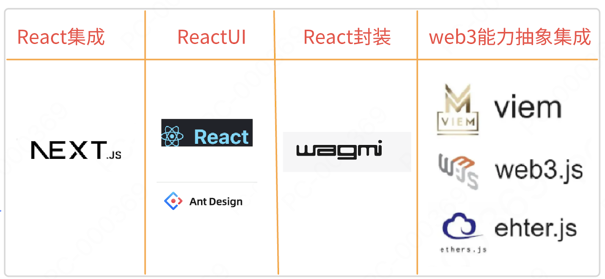

## 🤔为什么需要学习React生态

通过我目前的学习和观察开源的DApp代码，发现在web3领域的前端开发中React是主流，甚至可以说是唯一了，以及React集成框架Next.js 几乎是唯一的选择，因为爱所以爱，咱就只能学吧


👇先来回归一下前端的**技术实现层**的图


### 1.React 集成 Next.js

### 2.React UI层

### 3.React 封装
>Wagmi is a React Hooks library for Ethereum

```shell
$ npm install wagmi viem@2.x @tanstack/react-query
 ```


## 🔧 学习使用Vercel deploy  our web applications

从此篇以后，我会尝试更加多的英文描述，毕竟咱们要搞web3，学好英语和会用英语是必要的
> Vercel is the Frontend Cloud. Build, scale, and secure a faster, personalized web.