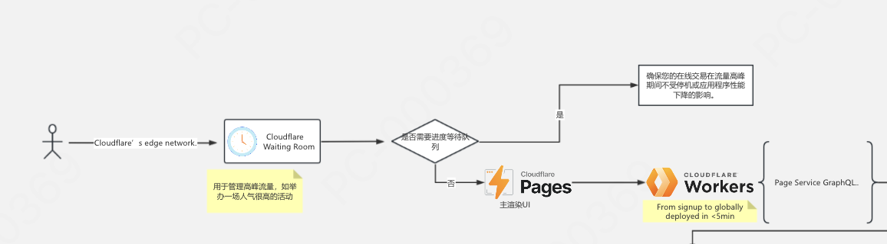
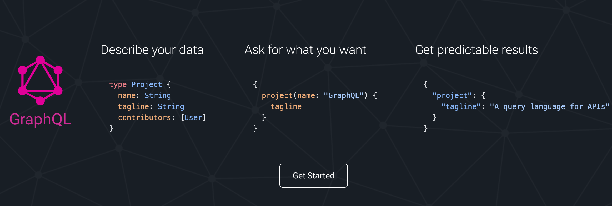

## 📑 第二节课课后笔记

 (https://www.processon.com/view/link/62e77f4f7d9c08072e6eea09)

本节课完成 
1. 购买一个域名 部署cloudflare上
2. Pages CI CD react
3. Workers + 前端连接上 使用GraphQL
4. Workers请求DeepSeek或者OpenAI
5. [我的第一个work]https://github.com/ShoshoWang/my-first-worker

架构图

步骤
1. open AI key openAI官网申请

### GraphQL官网学习

个人理解: A query language for our project's api

### Cloudflare workers学习