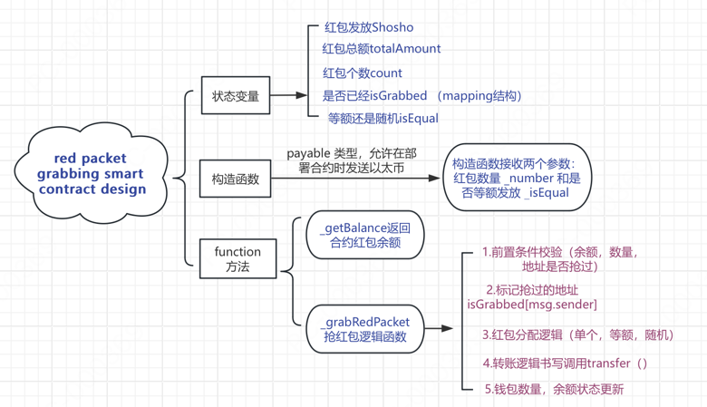

## 📖 What is smart contract（智能合约）

#### **Definition**
> A smart contract, like any contract, establishes the terms of an agreement. But unlike a traditional contract, a smart contract’s terms are executed as code running on a blockchain like Ethereum. Smart contracts allow developers to build apps that take advantage of blockchain security, reliability, and accessibility while offering sophisticated peer-to-peer functionality — everything from loans and insurance to logistics and gaming

🤔：我的理解就是，智能合约和传统合约一样，会列出协议或交易的条款，但是不同于咱们传统的文字，电子合同，智能合约它以在区块链上运行的代码形式制定和执行

#### **使用场景**

current smart-contract powered applications include
-  Uniswap (去中心化交易所)
-  Compound (借贷平台)
-  USDC/USDT(稳定币)
-  CryptoKitties/OpenSea (NFT)
-  MakerDAO (去中心化自治组织)
-  供应链和溯源管理

🌰：比如我持有一些Ethereum，我想把它换成稳定币，此时我可以去Uniswap，该平台会通过智能合约自动为我找到最佳汇率，进行交易，并提供兑换后我需要的usdt,之后我可以把我的稳定币投入到Compound平台，借给他人去获得利率利润

👆：以上所有的过程都没有任何中间商或者银行参与，都是去中心化的，并且都是安全的，因为这些都是基于区块链的智能合约实现的

#### **困惑为什么USDT也有智能合约？**
USDT（Tether）是一种稳定币，锚定美元价值（1 USDT ≈ 1 USD）。你可能困惑为什么一个“数字货币”也需要智能合约代码。原因在于，USDT并不是像比特币那样的原生区块链资产，而是基于某些区块链（如以太坊、Tron）的代币，依赖智能合约来运行

#### **知识点**
- 智能合约可以用多种编程语言编写（包括 Solidity、Web Assembly 和 Michelson）。在以太坊网络上，每个智能合约的代码都存储在区块链上，任何感兴趣的一方都可以检查合约的代码和当前状态，以验证其功能
- 网络上的每台计算机（或“节点”）都存储所有现有智能合约及其当前状态的副本以及区块链和交易数据
- 当智能合约收到用户的资金时，其代码将由网络中的所有节点执行，以就结果和由此产生的价值流达成共识。这使得智能合约能够在没有任何中心化机构的情况下安全运行，即使用户与未知实体进行复杂的金融交易也是如此
- 要在以太坊网络上执行智能合约，您通常需要支付称为“gas”的费用（之所以这样命名，是因为这些费用可以维持区块链的运行）
- 一旦部署到区块链上，智能合约通常就无法被修改，即使是其创建者也无法修改。（此规则也有例外。）这有助于确保智能合约不会被审查或关闭

#### **智能合约学习**

1. https://cryptozombies.io/en/course/ cryptozombies课程趣味好玩学习Solidity写合约
2. https://archive.trufflesuite.com/docs/truffle/quickstart/ 使用Truffle Suite写合约部署合约，套件中ganache是本地测试网络，可以模拟区块链，在本地测试合约
3. https://remix.ethereum.org/ 在线合约编辑器，支持在线部署合约
4. https://docs.family.co/connectkit/getting-started#getting-started connectkit钱包连接插件
5. https://wagmi.sh/react/guides/read-from-contract  React hook 与合约交互

#### **钱包与合约交互**
之前已经学习过前端的js逻辑链接钱包，今天学习使用钱包和合约逻辑交互

#### **周末老师留的作业**
1. 钱包UI部分选择connectkit、rainbowkit
2. 书写合约，前端使用wagmi与合约交互
3. 如果不想用1和2 请使用web3-react+ether.js
4. 部署一个发红包合约 构造函数的存取方式 换成一个独立的函数
function deposit() public payable {}
5. 用AI生成的代码务必你要理解 （要对你本次生成的代码录制视频逐行讲解）

#### **作业实现逻辑记录**

1. 第一步设计抢红的合约流程图


2. 第二部使用Truffle Suite写合约部署合约
```bash
npm install -g truffle
```
使用truffle开箱即用创建合约项目，再把本地的ganache测试网络配置到truffle-config.js中

3. 前端开发UI界面
```bash
npm install connectkit wagmi viem@2.x @tanstack/react-query
```
安装了connectkit钱包连接插件，wagmi是一个轻量级的React查询库，viem是一个轻量级的Ethereum库，@tanstack/react-query是一个轻量级的React查询库

使用改库后，我们可以在前端发红包页面，包一个Web3Provider基础设施组件，它让你能够在应用中方便地使用ConnectKit提供的钱包连接UI和Wagmi提供的区块链交互功能
```js
const Web3Provider = ({ children }: React.PropsWithChildren) => (
  <WagmiProvider config={config}>
    <QueryClientProvider client={queryClient}>
      <ConnectKitProvider>{children}</ConnectKitProvider>
    </QueryClientProvider>
  </WagmiProvider>
);
```
4. 前端与红包合约交互
前端组件中我们需要使用wagami的useContractWrite和useContractRead来与合约交互，useContractWrite是用来写合约的，useContractRead是用来读合约的
```js
// 读合约，写合约 把合约信息配置在contracts文件中
import { useReadContract, useWriteContract } from 'wagmi'
import { wagmiContractConfig } from './contracts'
```
5. 功能展示

